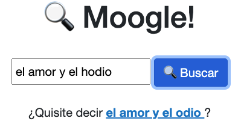

## Moogle! es una aplicación desarrollado con tecnología .NET Core 6.0 utilizando C# como lenguaje de programación. Es un motor de búsqueda cuya finalidad, como su nombre lo indica, es buscar, pero de forma inteligente un texto o una frase dada en un conjunto de documentos. El mismo cuenta con una interfaz gráfica en la cual podemos apreciar el logotipo y el nombre de la aplicación, así como la barra de búsqueda que es donde debemos introducir la palabra o frase que deseamos buscar; y junto a esta el botón de "buscar".

## Al iniciar el servidor los documentos son leidos y modelados como objetos de tipo Document, luego son utilizados para crear la instancia de vocabulary donde se guardadn todas las palabras y se calculan los pesos `tf-idf` acabando asi con una matriz del sistema donde cada fila es el vector de un documento. Dichos vectores son de n dimensionales donde n es la cantidad de terminos totales en el cospus (cuerpo de documentos) cada componente de estos vectores tendra los pesos `tf-idf` asociados a cada termino. Cuando se efectua una consulta en la interfaz grafica, esa informacion pasa a MoogeServer donde se modela esta informacion como un objeto de tipo ClassBase, durante esa modelacion se obtienen los operadores y sus palabras afectadas, se calcula al igual que en el caso de los documentos sus pesos `tf-idf` y toda esta informacion pasa a la instancia de vocabullary donde se utilizan para obtener los resultados de la busqueda, a traves del producto punto entre vectores se obtiene el score de relevancia para cada documento respecto al query, y luego esta busqueda es filtrada a traves de los operadores de busqueda, si alguna de las palabras de la busqueda no fue posible encontrarlas durante este proceso, utilizando la distancia de `Levenshtein` se computa la palabra de entre los documentos mas cercana a la que se escribio incorrectamente y se envia de vuelta al usuario en forma de `suggestion`.

!!EJEMPLO!!!

## `Tf-idf` expresa cuan relevante es una palablra para un documento en una coleccion. El valor `Tf-idf` aumenta proporcionalmente al numero de veces que una palabra aparece en el documento, pero es compensada por la frecuencia de la palabra en la coleccion de documentos, lo que permite manejar el hecho de que algunas palabras co mas relevantes que otras.

## Distancia de `Levenshtein` es el numero minimo de operaciones requeridas para transformar una cadena de caracteres en otra, estas operaciones son insercion, eliminacion o sustitucion de un caracter.
